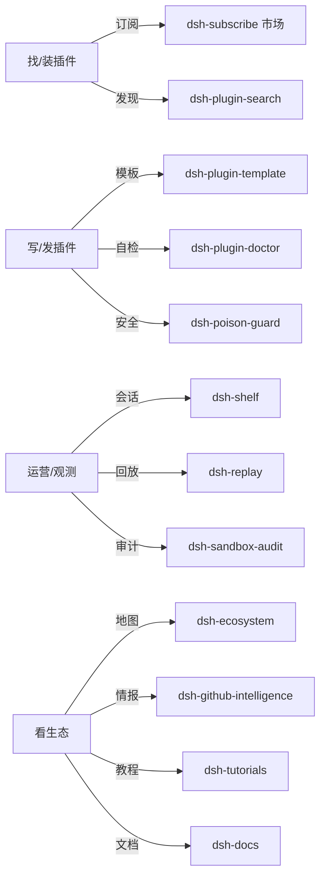

# DeepSeek Harness 全家桶中文总览

> 由 [zoahdev](https://github.com/zoahdev) 维护。这里串起我在 DeepSeek Harness（dsh）生态做的全部东西——每个仓库是干嘛的、彼此什么关系、新手从哪开始。**给中文读者的一页地图。**

**最新状态（2026-08）：** 48 个上游补丁 · 7 个 npm 包 · 9 个插件（npm + GitHub + CI 全绿）；收录 PR：awesome-dsh-plugin 8 个 + awesome-deepseek-harness 1 个（gate 转绿待合并） · 注册表 917 插件（325 可 npm 安装，质量评分已全覆盖） · 官方 RFC [#1814](https://github.com/deepseek-ai/deepseek-harness/discussions/1814)（dsh plugin check / doctor 采纳）与 [#2486](https://github.com/deepseek-ai/deepseek-harness/discussions/2486)（补丁队列）。

## 一句话看懂关系

## 六大板块

### ① 市场与分发 —— 怎么找插件、装插件

| 仓库 | 一句话 |
| --- | --- |
| [dsh-subscribe](https://github.com/zoahdev/dsh-subscribe) | Steam 式插件市场：网页一键订阅 + 一条命令同步进 dsh，900+ 插件注册表 |
| [dsh-marketplace](https://github.com/zoahdev/dsh-marketplace) | 开源插件市场：浏览、搜索、一条 `dsh` 命令安装 |
| [awesome-dsh-plugin](https://github.com/zoahdev/awesome-dsh-plugin) | 插件精选列表（zoahdev 已有 8 个项目被收录） |
| [dsh-plugin-search](https://github.com/zoahdev/dsh-plugin-search) | 在 dsh agent 里直接搜 npm + awesome 插件 |

### ② 开发工具链 —— 怎么写插件、发插件

| 仓库 | 一句话 |
| --- | --- |
| [dsh-plugin-template](https://github.com/zoahdev/dsh-plugin-template) | 已验证的最小插件模板：CI 真的会调用 tool（不只是加载成功） |
| [dsh-plugin-doctor](https://github.com/zoahdev/dsh-plugin-doctor) | 发布前健康检查：manifest/patch/build/pack/install + 环境诊断 + 投毒预检 |
| [dsh-plugin-doctor-action](https://github.com/zoahdev/dsh-plugin-doctor-action) | 上面那套健康检查的 GitHub Action，一行接入 CI |
| [dsh-rule-evolve](https://github.com/zoahdev/dsh-rule-evolve) | 验证驱动的自我进化：失败日志 → 经验 → 可审计的 AGENTS.md 规则 |
| [dsh-pet-evolve](https://github.com/zoahdev/dsh-pet-evolve) | 会随你的 agent 一起成长的电子宠物 |

### ③ 安全 —— 防投毒、防泄露、防越权

| 仓库 | 一句话 |
| --- | --- |
| [dsh-poison-guard](https://github.com/zoahdev/dsh-poison-guard) | 装插件前投毒扫描：AST（JS-X-Ray）+ 反混淆解码，拦混淆外发/eval/隐藏命令 |
| [dsh-poison-guard-action](https://github.com/zoahdev/dsh-poison-guard-action) | 投毒扫描的 GitHub Action |
| [dsh-redact](https://github.com/zoahdev/dsh-redact) | 分享会话日志前脱敏（API key/token/私钥/邮箱/路径） |
| [dsh-sandbox-audit](https://github.com/zoahdev/dsh-sandbox-audit) | 沙箱策略一致性审计（找出越权读/写/删） |

### ④ 内核层可观测 —— 看 agent 到底在干嘛

| 仓库 | 一句话 |
| --- | --- |
| [dsh-replay](https://github.com/zoahdev/dsh-replay) | 时间旅行调试器：回放整条轨迹（思考/工具调用/结果）并 diff |
| [dsh-trace](https://github.com/zoahdev/dsh-trace) | 聚合可观测仪表盘：token/tool/error/latency 一张 HTML 看全 |
| [dsh-compose-viz](https://github.com/zoahdev/dsh-compose-viz) | 可视化 preset 的 Cordis 组成（分组/隔离域/工具行） |
| [dsh-preset-diff](https://github.com/zoahdev/dsh-preset-diff) | 对比两个 agent preset 的差异 |
| [dsh-shelf](https://github.com/zoahdev/dsh-shelf) | 会话生命周期：导出/归档/回收站/搜索/统计 |

### ⑤ 生态情报 —— 看整个 dsh 生态

| 仓库 | 一句话 |
| --- | --- |
| [dsh-github-intelligence](https://github.com/zoahdev/dsh-github-intelligence) | 196+ 只读工具 × 16 个生态（GitHub/GitLab/npm/PyPI/ArXiv/...），带缓存 |
| [dsh-github-release-radar](https://github.com/zoahdev/dsh-github-release-radar) | Release/star/仓库搜索雷达，无需 API key |
| [dsh-ecosystem](https://github.com/zoahdev/dsh-ecosystem) | 生态地图：精选目录 + 周报 + 发布兼容性 + 补丁验证 |
| [dsh-ecosystem-status](https://github.com/zoahdev/dsh-ecosystem-status) | 自动生成的状态仪表盘 |
| [dsh-docs](https://github.com/zoahdev/dsh-docs) | 官方文档提案 + 48 张可 cherry-pick 的上游补丁 |
| [dsh-tutorials](https://github.com/zoahdev/dsh-tutorials) | 56 页（28 章 × 中英）双语教程：入门/架构/插件开发/发布自检/贡献路线/社区工作流 |

### ⑥ 官方上游

| 仓库 | 一句话 |
| --- | --- |
| [deepseek-harness](https://github.com/zoahdev/deepseek-harness) | 官方仓库 fork，带着 48 张补丁（根因 + 回归测试，等 PR 通道开） |

## 新手从哪开始

1. **想装插件** → 打开 [dsh-subscribe](https://github.com/zoahdev/dsh-subscribe)，网页订阅，一条命令同步。
2. **想写插件** → 复制 [dsh-plugin-template](https://github.com/zoahdev/dsh-plugin-template)，写完用 [dsh-plugin-doctor](https://github.com/zoahdev/dsh-plugin-doctor) 自检。
3. **怕装到毒** → 装 [dsh-poison-guard](https://github.com/zoahdev/dsh-poison-guard)，`dsh plugin add` 之前先扫一遍。
4. **想看懂 agent** → 用 [dsh-replay](https://github.com/zoahdev/dsh-replay) 回放、[dsh-trace](https://github.com/zoahdev/dsh-trace) 看指标。
5. **想跟上生态** → 看 [dsh-ecosystem](https://github.com/zoahdev/dsh-ecosystem) 周报 + [dsh-tutorials](https://github.com/zoahdev/dsh-tutorials) 教程。

> 一句话定位：**别人在做插件，我在做「装插件、发插件、防毒、看 agent、看生态」的地基。**

---

# DeepSeek Harness Ecosystem Map

> The living map of the dsh plugin ecosystem — curated, quality-signaled, and updated weekly. Maintained by [zoahdev](https://github.com/zoahdev).

 ·  · 

## What this is

DeepSeek Harness (`dsh`) went open source on 0.1.0-rc.6 and the ecosystem exploded in days: 2,958 repos carry the `dsh-plugin` topic, at least 8 curated lists exist, and new plugins appear hourly. Nobody was tracking **quality signals, bug status, and gaps** in one place. This map is that place.

- **[Weekly editions](./docs/)** — [2026-08-19 consolidated](./docs/weekly-2026-08-19.md) — what shipped, what broke, what got fixed.
- **[Curated plugin catalog](./docs/plugins.md)** — real dsh-installable plugins with category, author, visibility, and (where audited) verification signals.
- **Bug radar** — known upstream bugs with status, root cause, and fixes/workarounds.
- **Gap radar** — what the ecosystem is missing (and who is building it).
- **[Release compatibility reports](./docs/release-compat/)** — npm dist-tags + zoahdev suite CI + ecosystem health, auto-generated on every release train change.
- **[Official engagement dossier](./docs/official-engagement.md)** — one page of every upstream contribution (patches, RFCs, docs) with links and status.
- **[Known bug family map](./docs/bug-families.md)** — root-cause taxonomy of verified discussion families (dist-tags, %TEMP% cleanup, corrupt artifacts, symbol splits, reasoning aliases, Windows tokens, trust fences, tool-result observability).

## How to read quality signals

| Signal | Meaning |
|---|---|
| ✅ verified | I audited this repo: CI exists, a release/tarball exists, and (for zoahdev suite) real-registry agent-visibility tests pass |
| 🟡 signals partial | Some signals present (release or CI), not fully audited |
| ○ not audited | Listed from the topic/awesome/marketplace survey; quality not yet verified |

## Quick stats (2026-08-19)

- Official: `deepseek-ai/deepseek-harness` — 0.1.0-rc.7 (HEAD 99f6f02)
- Official discussions: 3000+ threads; zoahdev replies: 60+ evidence-grade (triage: `scripts/discussion-triage.mjs`, daily CI: `.github/workflows/discussion-triage.yml`)
- #2763 (broken `latest` dist-tag): still unfixed, family-wide 160/325 plugins affected (dsh-tools 78); what-if latest->rc.7 restores 100, 60 remain; verifier: `scripts/verify-2763-fix.mjs` (14 packages latest==next)
- Registry (dsh-subscribe): 917 plugins, 325 npm-installable, 78 B-grade tied to #2763 alone

## Quick stats (2026-08-15)

- Official: `deepseek-ai/deepseek-harness` — 103k★, 0.1.0-rc.6
- `dsh-plugin` topic: 2,958 repos (noisy: includes skills, desktops, and unrelated projects)
- Curated lists: 8+ (crowded — see [docs/plugins.md](./docs/plugins.md#curated-lists))
- Marketplaces/registries: dsh-marketplace (PR-based), dsh-market (in-DSH), several web marketplaces
- Tracked upstream bugs: 48 (48 cherry-pick-ready patches, see [patch list](https://github.com/zoahdev/dsh-docs/blob/main/docs/specs/upstream-patches.md))
- Gaps: 8 (see [Gap radar](./docs/weekly-2026-08-15.md#gap-radar))

## The zoahdev suite (fully verified)

| Repo | What | Verification |
|---|---|---|
| [dsh-subscribe](https://github.com/zoahdev/dsh-subscribe) | Steam-style market + 917-plugin registry + in-harness install | ✅ check-registry, CI, awesome #492 merged |
| [dsh-rule-evolve](https://github.com/zoahdev/dsh-rule-evolve) | Verification-driven self-evolution + badge | ✅ 18 tests, awesome #560 merged |
| [dsh-plugin-doctor](https://github.com/zoahdev/dsh-plugin-doctor) | Pre-publish preflight + env explain + entry-points + profile-shadow | ✅ 49 tests + dsh-doctor/v1 contract |
| [dsh-plugin-doctor-action](https://github.com/zoahdev/dsh-plugin-doctor-action) | One-line GitHub Action CI gate for plugin authors | ✅ @v1, Release tarball |
| [dsh-shelf](https://github.com/zoahdev/dsh-shelf) | Session lifecycle: web panel + CLI + verify/rescue | ✅ 14 tests |
| [dsh-pet-evolve](https://github.com/zoahdev/dsh-pet-evolve) | The pet that grows with your agent | ✅ 13 tests |
| [dsh-github-intelligence](https://github.com/zoahdev/dsh-github-intelligence) | 196+ tools × 16 ecosystems + weekly digest | ✅ real-API smoke, 47 tests, CI |
| [dsh-plugin-search](https://github.com/zoahdev/dsh-plugin-search) | Plugin discovery inside DSH | ✅ 6 tests, visibility, CI |
| [dsh-github-release-radar](https://github.com/zoahdev/dsh-github-release-radar) | Releases/stars/tags radar | ✅ 16 tests, visibility, CI |
| [dsh-plugin-template](https://github.com/zoahdev/dsh-plugin-template) | Verified template with peer guard | ✅ CI |
| [dsh-tutorials](https://github.com/zoahdev/dsh-tutorials) | 52-page (26 chapters zh/en) bilingual tutorial site | ✅ Pages live |
| [dsh-docs](https://github.com/zoahdev/dsh-docs) | Official-docs gap specs + upstream patch list | ✅ 48 patches documented |
| [dsh-ecosystem](https://github.com/zoahdev/dsh-ecosystem) | Map + weekly + release-compat + patch-verify | ✅ 48-branch patch-verify bot |

## Live dashboard

- [Ecosystem health dashboard](https://zoahdev.github.io/dsh-ecosystem/ecosystem-health-dashboard.html) — supply-chain scan, #2763 impact, quality leaderboard v1 (325 plugins, 240A/84B/1F) in one page.

## #2763 fix-day verifier

Run `node scripts/verify-2763-fix.mjs` — detects when the official `latest` dist-tag changes, then re-scans the registry, re-scores the leaderboard, and writes the impact-drop report.

## Contribute

- Know a plugin that should be in the catalog? Open an issue or PR with the repo URL.
- Found a bug not on the radar? Open an issue.
- Want to take a gap? Say so in the issue — the map will track it.

## License

CC0 — the map is data; use it freely.
---

# 中文说明

**DeepSeek Harness 插件生态地图。**

> 由 [zoahdev](https://github.com/zoahdev) 维护，每周更新，带质量信号。

DeepSeek Harness（`dsh`）在 0.1.0-rc.6 开源后，生态几天内爆发：2958 个仓库挂了 `dsh-plugin` 标签，至少 8 个精选列表，新插件每小时都在出现。但没人在一个地方统一追踪**质量信号、bug 状态、生态空白**。这张地图就是那个地方。

## 包含什么

- **周报**（`docs/`）：本周上了什么、坏了什么、修了什么。
- **精选插件目录**（`docs/plugins.md`）：真实可装的插件，带分类、作者、可见性、验证信号。
- **Bug 雷达**：已知上游 bug，带状态、根因、修复/规避方案。
- **空白雷达**：生态还缺什么（以及谁在做）。
- **发布兼容性报告**（`docs/release-compat/`）：npm dist-tags + zoahdev 套件 CI + 生态健康，每次 release train 变化自动生成。
- **官方互动档案**（docs/official-engagement.md）：一页列出所有上游贡献（补丁、RFC、文档）及状态链接。
- **已知问题家族图谱**（docs/bug-families.md）：已核验讨论家族的根因分类（dist-tag、%TEMP% 清理、坏工件隔离、符号分裂、推理字段别名、Windows 令牌、远程信任边界、工具结果可信度）。

## 质量信号怎么看

| 信号 | 含义 |
|---|---|
| ✅ verified | 我已审计：有 CI、有 release/tarball，（zoahdev 套件）还通过了真实注册表的 agent 可见性测试 |
| 🟡 signals partial | 有部分信号（release 或 CI），未完全审计 |
| ○ not audited | 从 topic/awesome/marketplace 调研收录，质量未验证 |

## 许可

CC0——地图是数据，随意使用。
